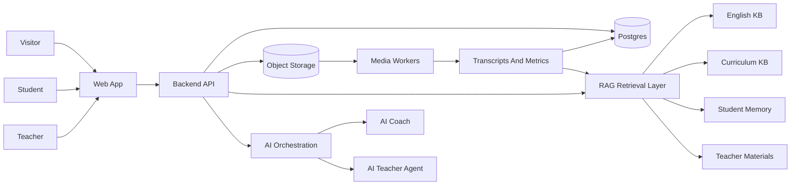
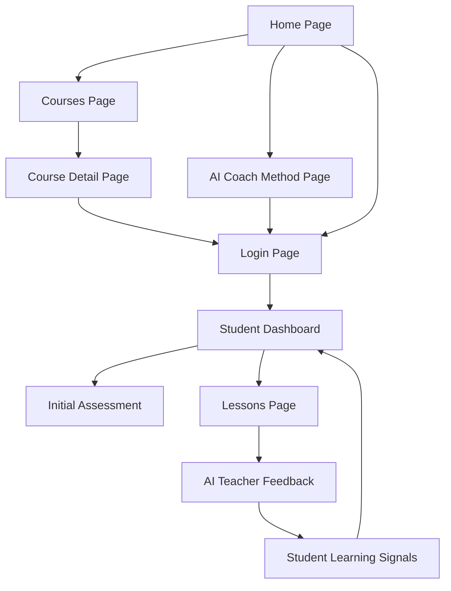
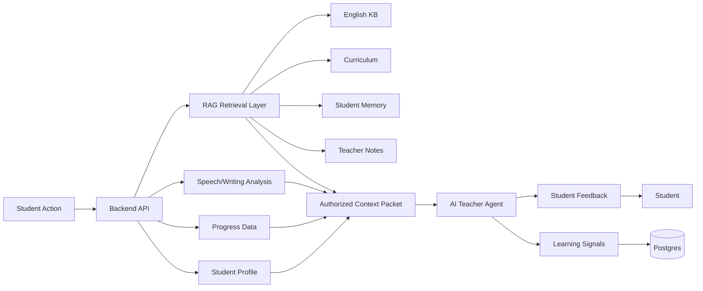
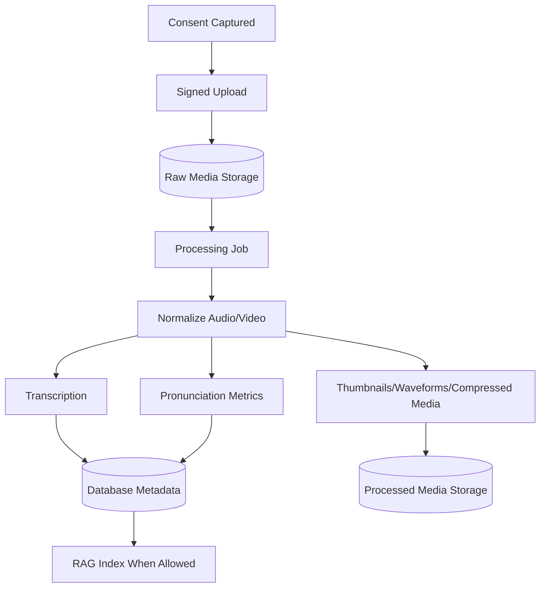
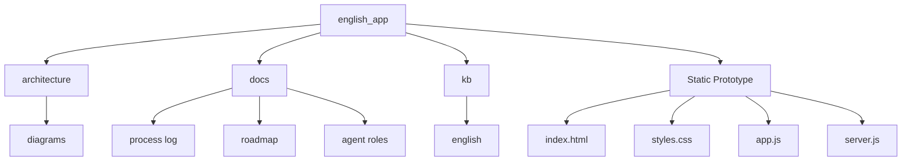

# Diagrams

These diagrams use Mermaid syntax.

## High-Level System

```mermaid
flowchart LR
  Visitor[Visitor] --> Web[Web App]
  Student[Student] --> Web
  Teacher[Teacher] --> Web

  Web --> API[Backend API]
  API --> DB[(Postgres)]
  API --> Storage[(Object Storage)]
  API --> RAG[RAG Retrieval Layer]
  API --> AI[AI Orchestration]

  Storage --> Workers[Media Workers]
  Workers --> Transcripts[Transcripts And Metrics]
  Transcripts --> DB
  Transcripts --> RAG

  RAG --> EnglishKB[English KB]
  RAG --> CurriculumKB[Curriculum KB]
  RAG --> StudentMemory[Student Memory]
  RAG --> TeacherMaterials[Teacher Materials]

  AI --> Coach[AI Coach]
  AI --> TeacherAgent[AI Teacher Agent]
```

## Public To Student Flow

```mermaid
flowchart TD
  Home[Home Page] --> Courses[Courses Page]
  Home --> Method[AI Coach Method Page]
  Courses --> CourseDetail[Course Detail Page]
  CourseDetail --> Login[Login Page]
  Method --> Login
  Home --> Login
  Login --> Dashboard[Student Dashboard]
  Dashboard --> Assessment[Initial Assessment]
  Dashboard --> Lessons[Lessons Page]
  Lessons --> Feedback[AI Teacher Feedback]
  Feedback --> Memory[Student Learning Signals]
  Memory --> Dashboard
```

## AI Teacher Context Flow

```mermaid
flowchart LR
  StudentAction[Student Action] --> API[Backend API]
  API --> Profile[Student Profile]
  API --> Progress[Progress Data]
  API --> Analysis[Speech/Writing Analysis]
  API --> RAG[RAG Retrieval Layer]

  RAG --> EnglishKB[English KB]
  RAG --> Curriculum[Curriculum]
  RAG --> StudentMemory[Student Memory]
  RAG --> TeacherNotes[Teacher Notes]

  Profile --> Context[Authorized Context Packet]
  Progress --> Context
  Analysis --> Context
  RAG --> Context

  Context --> AITeacher[AI Teacher Agent]
  AITeacher --> Response[Student Feedback]
  AITeacher --> Signals[Learning Signals]
  Signals --> DB[(Postgres)]
  Response --> Student[Student]
```

## Media Processing Flow

```mermaid
flowchart TD
  Consent[Consent Captured] --> Upload[Signed Upload]
  Upload --> RawMedia[(Raw Media Storage)]
  RawMedia --> Job[Processing Job]
  Job --> Normalize[Normalize Audio/Video]
  Normalize --> Transcribe[Transcription]
  Normalize --> Pronunciation[Pronunciation Metrics]
  Normalize --> Derivatives[Thumbnails/Waveforms/Compressed Media]
  Transcribe --> Metadata[(Database Metadata)]
  Pronunciation --> Metadata
  Derivatives --> ProcessedStorage[(Processed Media Storage)]
  Metadata --> RAGIndex[RAG Index When Allowed]
```

## Repository Structure

```mermaid
flowchart TD
  Repo[english_app] --> Architecture[architecture]
  Repo --> Docs[docs]
  Repo --> KB[kb]
  Repo --> Prototype[Static Prototype]
  Prototype --> HTML[index.html]
  Prototype --> CSS[styles.css]
  Prototype --> JS[app.js]
  Prototype --> Server[server.js]
  KB --> EnglishKB[english]
  Docs --> Process[process log]
  Docs --> Roadmap[roadmap]
  Docs --> Agents[agent roles]
  Architecture --> Diagrams[diagrams]
```
