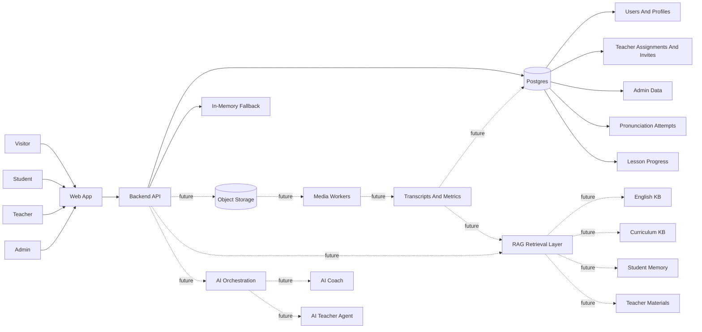
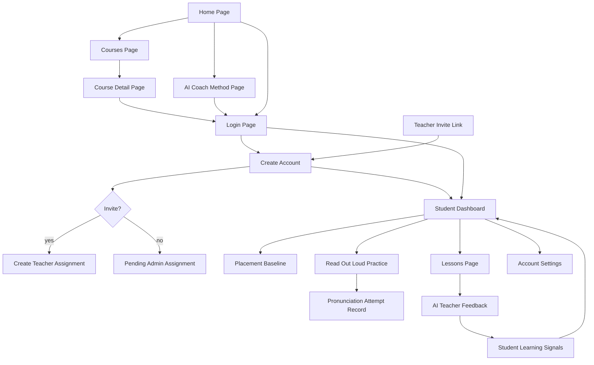
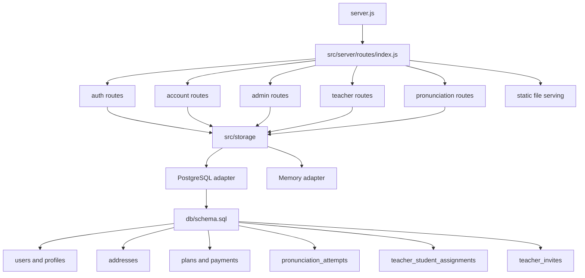
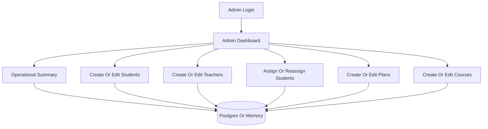
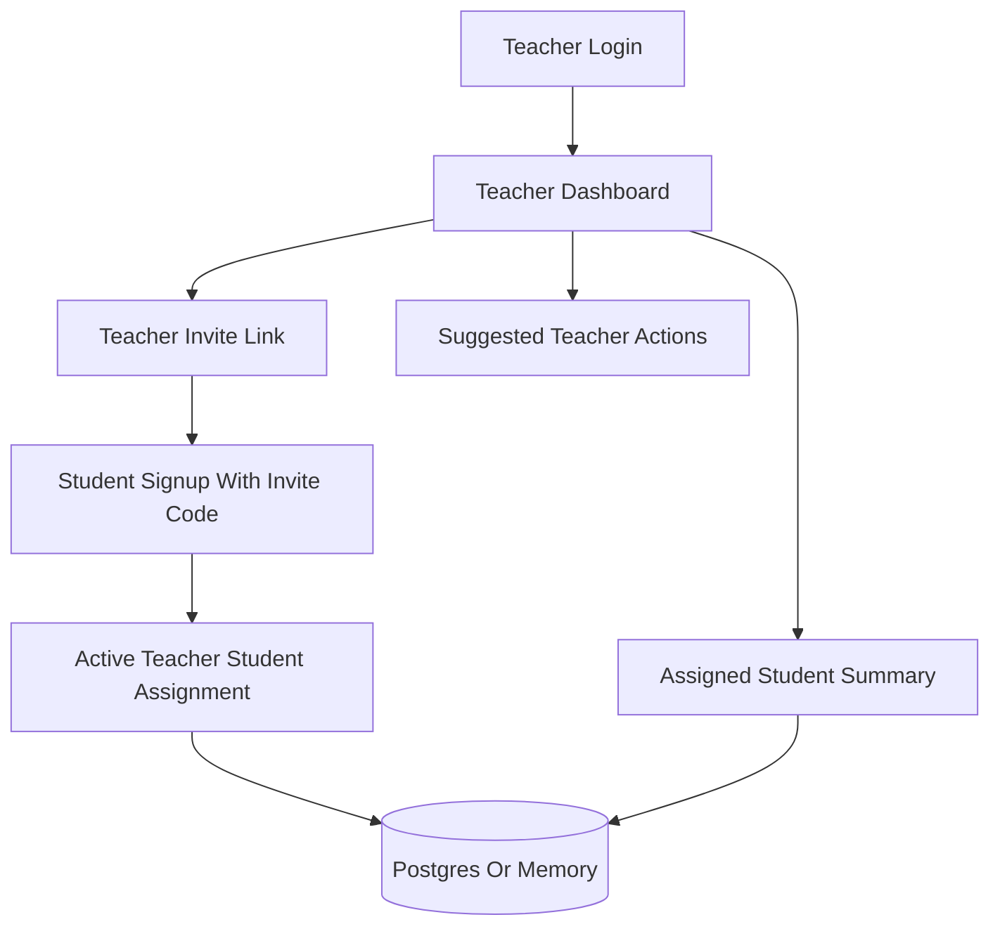
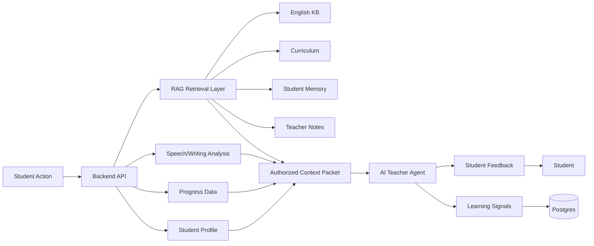
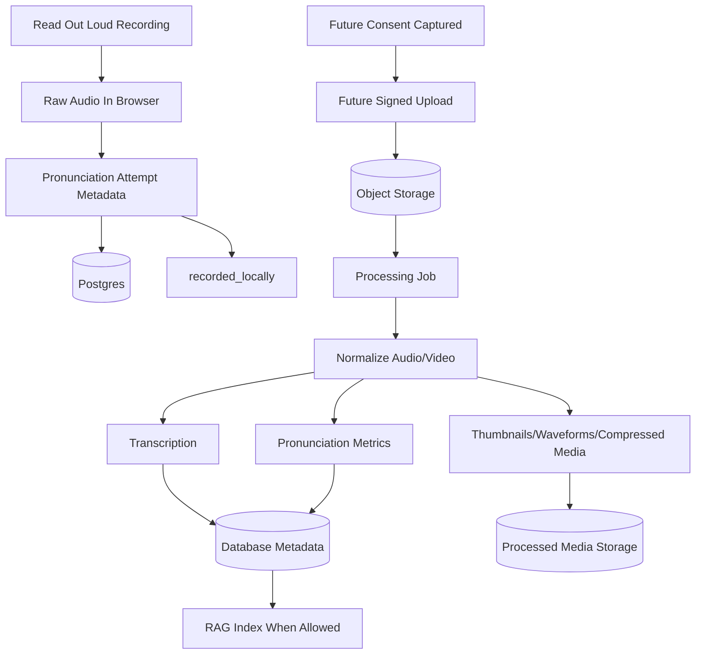
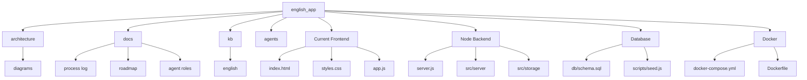

# Diagrams

These diagrams use Mermaid syntax.

## High-Level System

## Public To Student Flow

## Backend API Structure

## Admin Flow

## Teacher Flow

## AI Teacher Context Flow

## Media Processing Flow

## Repository Structure

